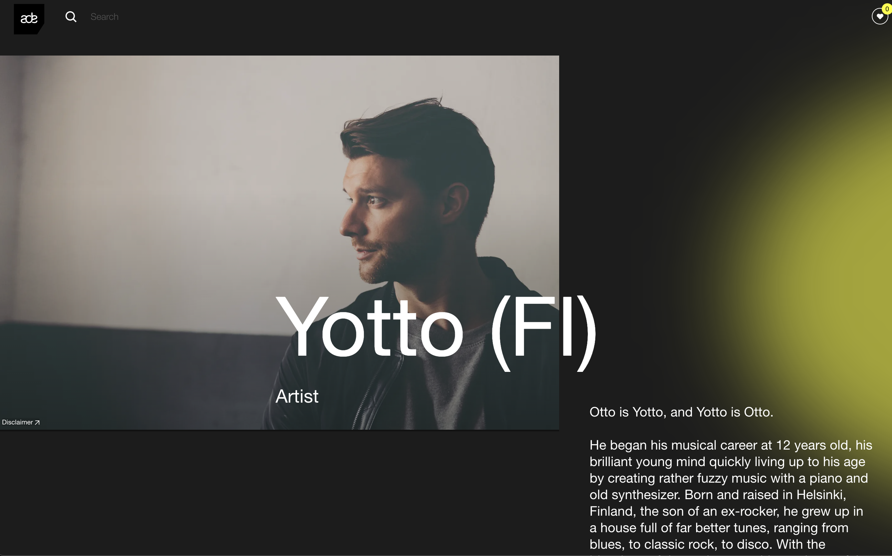
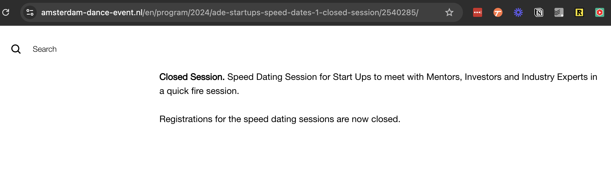

- 22:17 happy friday, busy n fun challenging week!
	- gosh! just discovered this it was [[ade - amsterdam dance event]] this week
		- 
	- about [[ade - amsterdam dance event]]
		- https://assets.amsterdam-dance-event.nl/images/images/venues/_2400x1600_crop_center-center_none/2539578/1_Jasper-ten-Tusscher_ADE_FELIX-MERITIS_DEFQON_1018-1727102158.webp
		-
		- week long conference + music event combining artists and music tech together
			- music tech
			- artists live shows
			- art and performance
			- business, incubation, startups
		- imagine
			- waking up to attend your favorite artist's fireside chat about creative art -  like [kolsch talking about his career n production process](https://www.amsterdam-dance-event.nl/en/program/2024/kolsch-a-career-in-music/2523557/)
			- see [[yotto]] play in the evening
				- 
			- randomly exploring a talk on "Data & Marketing: How to capture Artist Fan Data & Sell More Tickets"
				- `Sam Alpert (SVP Marketing of Music, Wasserman), Rob Sealy (Chief Strategy Officer, OpenStage)`
			- to exploring a startup community on music - startups x investors x indsutry expert speed dating
			- 
		- https://www.amsterdam-dance-event.nl/en/live/
-
	- well, this mean lots of kool recorded radio sets on youtube
		- [[you're listening to kool.fm]] [[ade - amsterdam dance event]] special
			- [[artist's spotlight]] [[armin van buuren]]
			- who better to start than amsterdam based state of trance
			- 10 hour special, my god!
			- {{video https://www.youtube.com/watch?v=bct_6iLtiOQ}}
			-