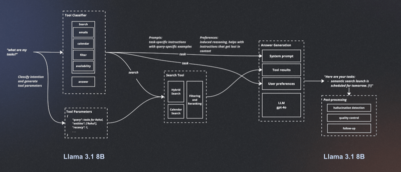
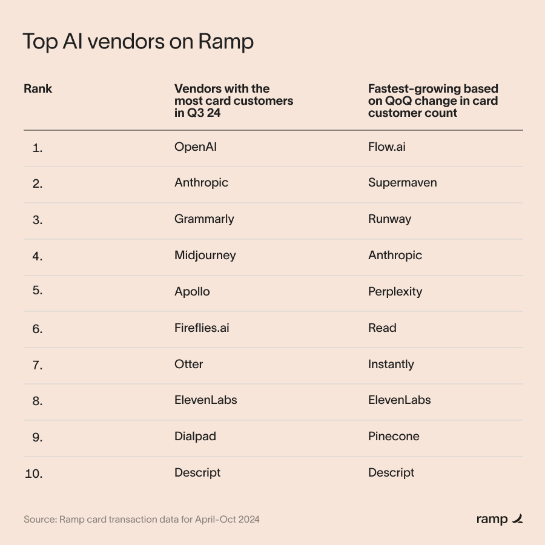

- [[ai agents]]
	- https://www.langchain.com/breakoutagents/superhuman
	- https://www.langchain.com/breakoutagents/perplexity
-
- [[x bookmarks worth sharing]]
	- https://x.com/Suhail/status/1851307253795864643
		- 
	- https://x.com/hwchase17/status/1851370423138554007
		- 
		-
-
- fanstastic report - [[ramp]] x ai vendors growth
	- https://ramp.com/blog/ai-multihoming-spend-data
	- 
	-
-
- prep work for upcoming [[ismir]] 2024
  id:: 6721b0fc-b20e-48c2-bf8a-b6c7bc5b61c2
	- [[Nov 10th, 2024]] sunday tutorial
	- [[Nov 12th, 2024]] [[riffusion]] x [[ismir]] at audiophone hayes (across riffusion)
	- [[Nov 14th, 2024]] conference day + conference dinner
	- papers of interest
		- https://confcats-siteplex.s3.us-east-1.amazonaws.com/ismir24/ISMIR_2024_Master_Data_Program_1_cb4cf788ce.pdf
		- https://ismir2024.ismir.net/accepted-papers
			- Combining audio control and style transfer using latent diffusion
			- ComposerX: Multi-Agent Music Generation with LLMs
			- DIFF-A-RIFF: MUSICAL ACCOMPANIMENT CO-CREATION VIA LATENT DIFFUSION MODELS
			- Which audio features can predict the dynamic musical emotions of both composers and listeners?
			- | Transcription-based lyrics embeddings: simple extraction of effective lyrics embeddings from audio |
-
- [[you're listening to kool.fm]]
	- [[artist's spotlight]] [[sultan shepard]] - dialekt radio 253
		- {{video https://youtu.be/ywQFJpGjeBY?si=0JdYJHv8_83v-mZs}}
	- track of the day {{video https://youtu.be/FbTZd9fpMzU?si=rTpl5_UIodB3rZl1}}
	-
-