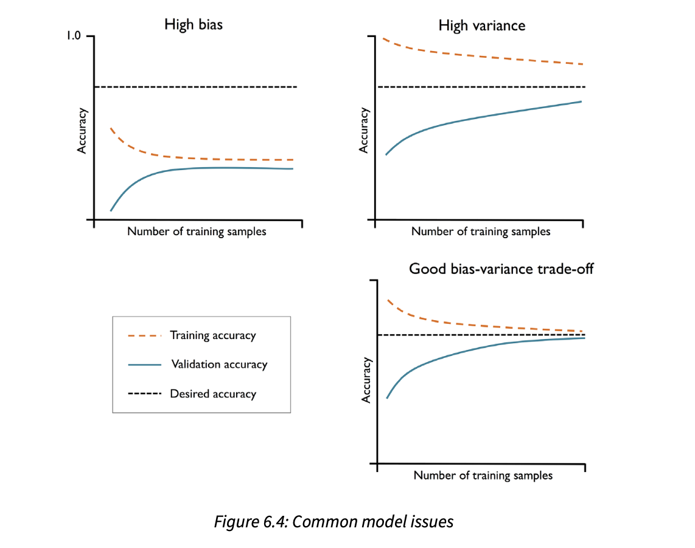
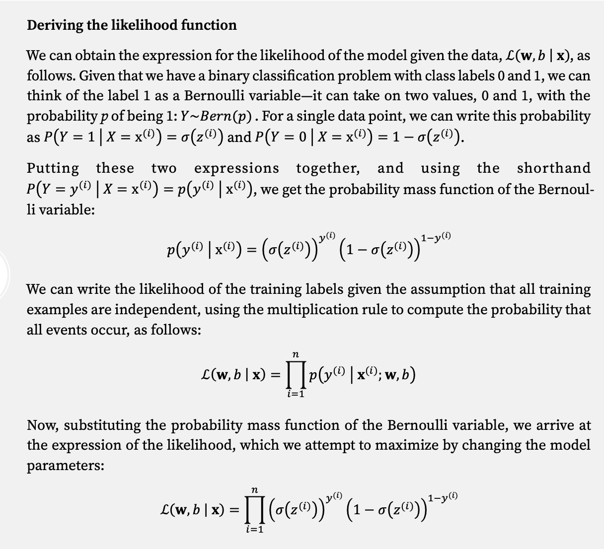
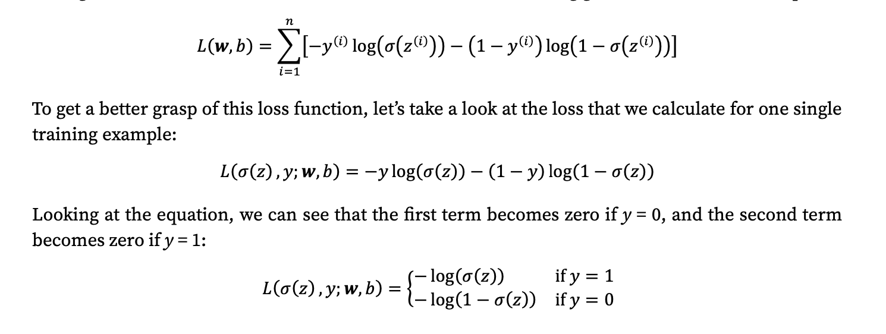
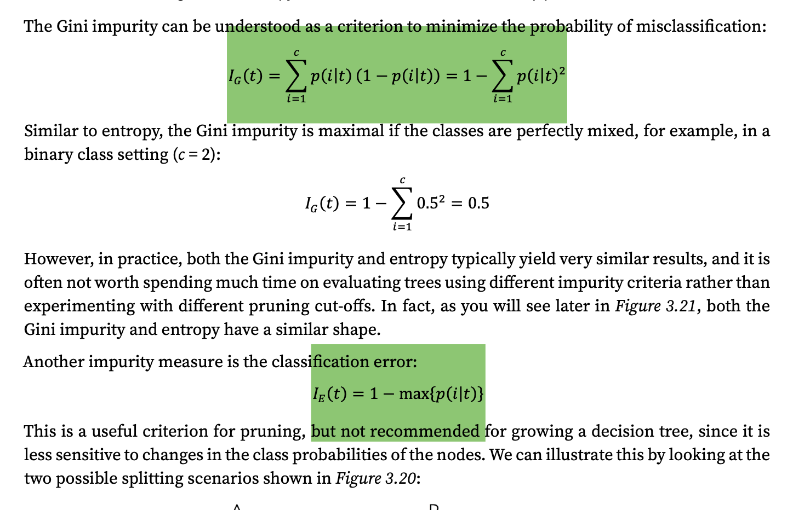
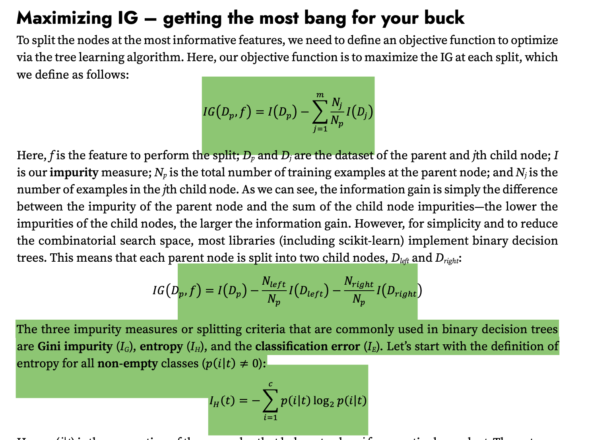
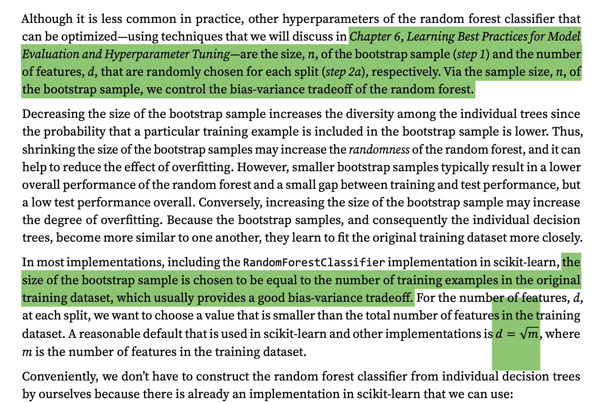
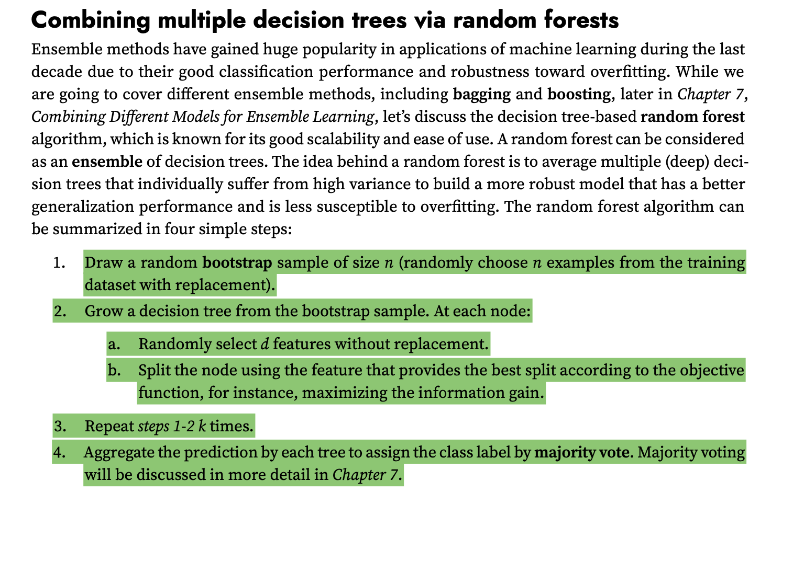
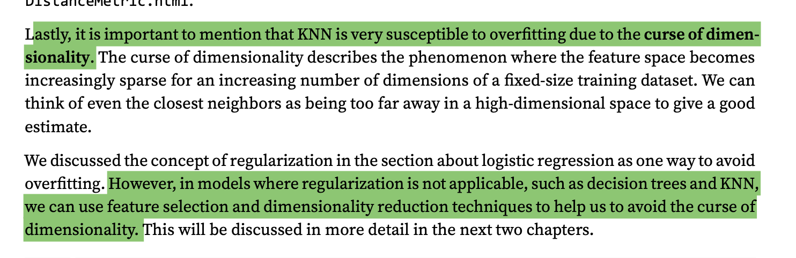
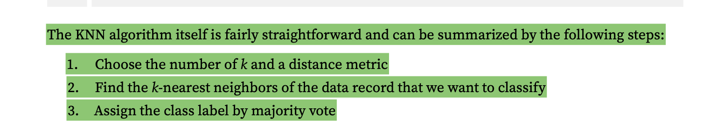

- resources
	- https://github.com/rasbt/machine-learning-book
- concepts
	- bias/variance
		- bias - how far off predictions if we rebuild model on different datasets, underfitting
		- variance - consistency of predictions if we retrain models multiple times on different datasets, overfitting
		- resources
		  collapsed:: true
			- 
	- regularization
		- handling collinearity (high correlation among features), filtering out noise from data, and eventually preventing overfitting.
		- penalize extreme param weights (L2 regularization)
			- ``lambda/2 * np.sum(w * w)``
			- lambda is regularization param, regularization strength, fit model while keeping weights small
			- needs feature scaling to work properly
		- prevent overfitting
	- gradient descent
	- boosting/bagging
	- loss
		- mse
		- mae
		- logloss
	- sampling
		- weighted
		- stratified
		- reservior
		- https://claude.site/artifacts/7dfe05bf-40bd-4b0b-a788-194e8411db72
		-
	- optimizers
	- hyperparams
		- k-fold cross validation
			- average loss from each fold
			- stratified k fold to retain distribution
		- grid search with k fold cv
		- random search : draw hyperparameter configurations randomly from distributions (or discrete sets
		-
- algos
	- logistic regression
		- logit
			- ``logit(p) = log (p/1-p)``
			- ``logit(p) = wx + b``
			- transforms 0-1 into a real number
		- logsitic
			- inverse of logit = sigmoid
			- sigmoid = ``1/(1 + e^-x)``
			- sigmoid turns real number into 0 to 1
			- ``p = inverse(logit(p))``
			- ``p = 1/(1 + e^(wx + b)``
		- loss
			- 
			- 
			- ```
			  def fit(self, X, y):
			      """ Fit training data.
			      Parameters
			      ----------
			      X : {array-like}, shape = [n_examples, n_features]
			        Training vectors, where n_examples is the
			        number of examples and n_features is the
			        number of features.
			      y : array-like, shape = [n_examples]
			        Target values.
			      Returns
			      -------
			      self : Instance of LogisticRegressionGD
			  """
			      rgen = np.random.RandomState(self.random_state)
			      self.w_ = rgen.normal(loc=0.0, scale=0.01, size=X.shape[1])
			      self.b_ = np.float_(0.)
			      self.losses_ = []
			      for i in range(self.n_iter):
			          net_input = self.net_input(X)
			          output = self.activation(net_input)
			          errors = (y - output)
			          self.w_ += self.eta * 2.0 * X.T.dot(errors) / X.shape[0]
			          self.b_ += self.eta * 2.0 * errors.mean()
			          loss = (-y.dot(np.log(output))
			                 - ((1 - y).dot(np.log(1 - output)))
			                  / X.shape[0])
			          self.losses_.append(loss)
			      return self
			      
			  def net_input(self, X):
			      """Calculate net input"""
			      return np.dot(X, self.w_) + self.b_
			  
			  def activation(self, z):
			      """Compute logistic sigmoid activation"""
			      return 1. / (1. + np.exp(-np.clip(z, -250, 250)))
			  ```
	- decision tree
		- Information gain at node j with parent p
		- ig at node p for feature f = impurity(parent) - (weighted sum nj/np * impurity (j) for each class)
		- impurity
			- gini
				- sum over all classes p*(1-p)
			- entropy
				- sum of -plogp over all classes
			- classfication error
				- 1- max(p)
		- hyperparams = bootstrap samples, n
		- references
			- 
			- 
			-
			-
	- random forest
		- algo
			- choose a bootstrap sample with replacement
			- build a decision tree n level deep with each node chosen from random d features(without replacement) which maximizes IG
			- repeat
			- use majority voting
		- hyperparams
			- d = sq(m features)
			- depth n
			- sample bootstrap size
		- low variance, high bias
		- references
			- 
			- 
			-
	- knn
		- algo
			- pick k random clusters
			- assign each point to a cluster
			- replace clusters with cluster mean of each cluster
			- assign class using majority voting
		- overfits, solved by feature selection or dim reduction
		- references
			- 
			- 
			-
	- gbm
	- multi layer perceptron
- chapters
	-
	-
	-